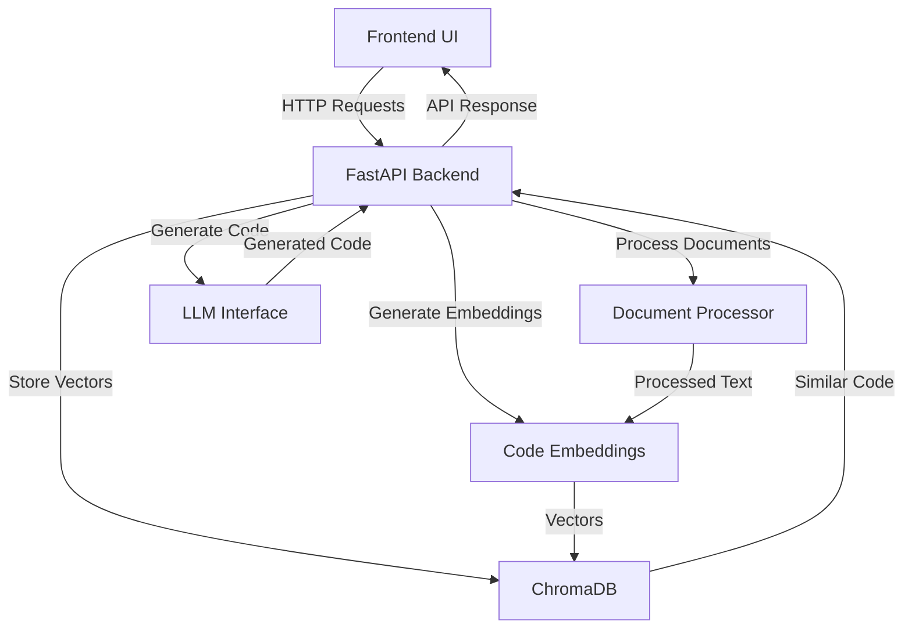
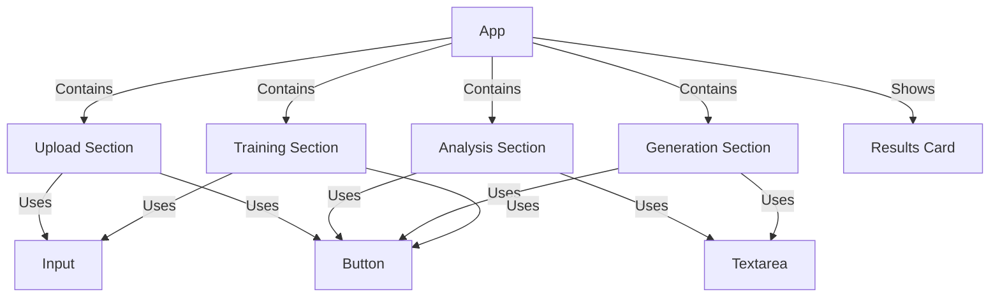
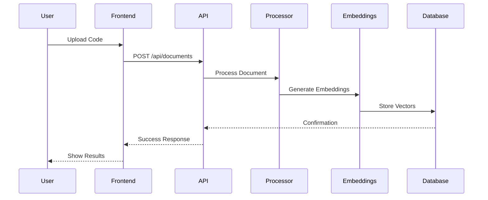

# Pronto 4GL Assistant Architecture Documentation

## System Overview

The Pronto 4GL Assistant is a comprehensive code analysis and generation system that combines modern web technologies with AI capabilities to assist developers working with Pronto 4GL code.

### Core Components

1. **Frontend Application (React + TypeScript)**
   - User Interface for code interaction
   - File upload capabilities
   - Code analysis interface
   - Code generation interface
   - Training system interface

2. **Backend Services (Python + FastAPI)**
   - Document processing
   - Code analysis
   - Code generation
   - Training pipeline
   - Vector database management

3. **AI and Machine Learning**
   - Vector embeddings for code
   - Similarity search
   - Code pattern recognition
   - Context-aware code generation

### Component Interactions



## Frontend Architecture

### Key Components

1. **App.tsx**
   - Main application container
   - State management
   - API integration
   - Component composition

2. **UI Components**
   - Button
   - Input
   - Textarea
   - Card
   - Alert
   - Navigation Menu
   - Sidebar
   - Tabs
   - Scroll Area

### Component Hierarchy



## Backend Architecture

### Core Services

1. **Document Processing**
   ```python
   class Pronto4GLProcessor:
       - process_document()
       - validate_file()
       - extract_metadata()
   ```

2. **Code Embeddings**
   ```python
   class CodeEmbeddings:
       - encode_code()
       - encode_query()
       - get_similar_snippets()
   ```

3. **Training System**
   ```python
   class Pronto4GLTrainer:
       - train()
       - load_documents()
       - store_embeddings()
       - query_similar()
   ```

### Data Flow



## API Endpoints

### Document Management
- `POST /api/documents`
  - Upload and process Pronto 4GL documents
  - Handles file validation and size limits
  - Returns processing results and suggestions

### Code Analysis
- `POST /api/analyze`
  - Analyzes provided code snippets
  - Returns quality metrics and suggestions
  - Integrates with vector similarity search

### Code Generation
- `POST /api/generate`
  - Generates Pronto 4GL code from descriptions
  - Uses context from similar code examples
  - Returns formatted code with explanations

### System Training
- `POST /api/train`
  - Processes directories of code files
  - Updates vector database
  - Returns training statistics

## Security Considerations

1. **File Upload Security**
   - Size limits (1GB max)
   - File type validation
   - Content sanitization

2. **API Security**
   - CORS configuration
   - Request validation
   - Error handling

3. **Data Protection**
   - Secure storage
   - Access controls
   - Input validation

## Performance Optimizations

1. **Frontend**
   - Efficient state management
   - Lazy loading components
   - Optimized API calls

2. **Backend**
   - Batch processing
   - Caching strategies
   - Efficient vector operations

## Development Workflow

1. **Local Development**
   ```bash
   # Frontend
   cd pronto-rag-assistant-ui
   npm install
   npm run dev

   # Backend
   cd pronto-rag-assistant
   poetry install
   poetry run uvicorn src.api.routes:app --reload
   ```

2. **Testing**
   ```bash
   # Frontend Tests
   npm test

   # Backend Tests
   poetry run pytest
   ```

3. **Deployment**
   - Frontend deployment
   - Backend API deployment
   - Database setup
   - Environment configuration

## Future Enhancements

1. **Planned Features**
   - Thread management
   - Advanced code analysis
   - Enhanced code generation
   - Improved training pipeline

2. **Technical Improvements**
   - Performance optimizations
   - Enhanced security
   - Better error handling
   - Extended documentation
