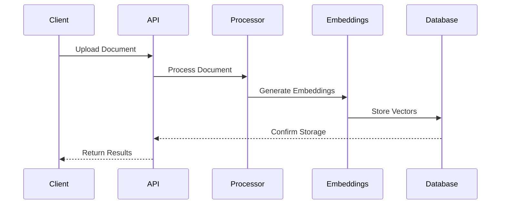
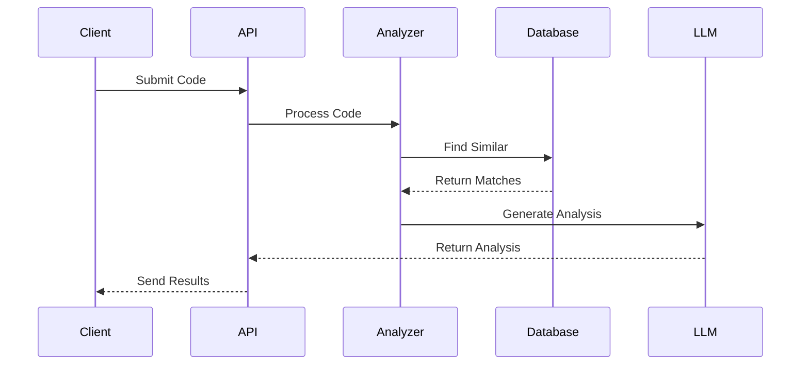
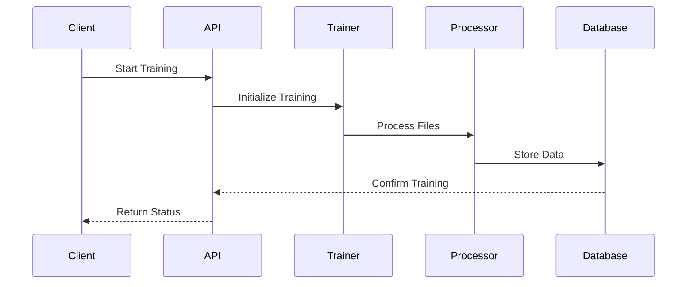

# Backend Components Documentation

## Overview
The backend system provides the core functionality for code processing, analysis, and generation. Built with Python and FastAPI, it integrates various components for efficient code handling.

## Core Components

### Document Processor
```python
class Pronto4GLProcessor:
    """Handles Pronto 4GL document processing and validation."""
    
    def process_document(self, content: str) -> Dict:
        """
        Process a Pronto 4GL document.
        
        Steps:
        1. Validate content
        2. Extract metadata
        3. Split into chunks
        4. Generate suggestions
        """
        
    def validate_file(self, filename: str) -> bool:
        """
        Validate file type and format.
        
        Checks:
        - File extension
        - Content format
        - Size limits
        """
```

### Code Embeddings
```python
class CodeEmbeddings:
    """Manages code vector embeddings generation."""
    
    def encode_code(self, code_snippets: List[str]) -> List:
        """
        Generate embeddings for code snippets.
        
        Process:
        1. Preprocess code
        2. Generate vectors
        3. Return embeddings
        """
        
    def get_similar_snippets(self, query: str, code_snippets: List[str]) -> List[Dict]:
        """
        Find similar code snippets.
        
        Steps:
        1. Encode query
        2. Compare vectors
        3. Rank results
        """
```

### Training System
```python
class Pronto4GLTrainer:
    """Manages system training with code examples."""
    
    def train(self, code_directory: str) -> Dict:
        """
        Train system with code files.
        
        Process:
        1. Load documents
        2. Process content
        3. Generate embeddings
        4. Store in database
        """
        
    def query_similar(self, query: str, top_k: int = 3) -> List[Dict]:
        """
        Query similar code examples.
        
        Steps:
        1. Process query
        2. Search database
        3. Return matches
        """
```

## API Routes

### Document Upload
```python
@app.post("/api/documents")
async def upload_document(file: UploadFile):
    """
    Handle document uploads.
    
    Process:
    1. Validate file
    2. Process content
    3. Store results
    4. Return response
    """
```

### Code Analysis
```python
@app.post("/api/analyze")
async def analyze_code(query: CodeQuery):
    """
    Analyze code snippets.
    
    Steps:
    1. Validate input
    2. Process code
    3. Generate analysis
    4. Return results
    """
```

### Code Generation
```python
@app.post("/api/generate")
async def generate_code(description: str):
    """
    Generate code from description.
    
    Process:
    1. Process description
    2. Find similar examples
    3. Generate code
    4. Return result
    """
```

## Data Flow Diagrams

### Document Processing Flow


### Code Analysis Flow


### Training Flow


## Error Handling

### Input Validation
```python
def validate_input(data: Dict) -> bool:
    """
    Validate input data.
    
    Checks:
    - Required fields
    - Data types
    - Value ranges
    """
```

### Error Responses
```python
@app.exception_handler(HTTPException)
async def http_exception_handler(request: Request, exc: HTTPException):
    """
    Handle HTTP exceptions.
    
    Returns:
    - Error message
    - Status code
    - Additional details
    """
```


## Performance Optimizations

### Caching
```python
class CacheManager:
    """
    Manage response caching.
    
    Features:
    - In-memory cache
    - Cache invalidation
    - Size limits
    """
```

### Batch Processing
```python
class BatchProcessor:
    """
    Handle batch operations.
    
    Features:
    - Queue management
    - Parallel processing
    - Result aggregation
    """
```

## Security Measures

### Input Sanitization
```python
def sanitize_input(data: str) -> str:
    """
    Sanitize user input.
    
    Steps:
    1. Remove dangerous content
    2. Validate format
    3. Normalize data
    """
```

### Access Control
```python
def verify_access(request: Request) -> bool:
    """
    Verify request access.
    
    Checks:
    - Authentication
    - Authorization
    - Rate limits
    """
```

## Testing Strategy

### Unit Tests
```python
class TestProcessor:
    """
    Test document processing.
    
    Cases:
    - Valid input
    - Invalid input
    - Edge cases
    """
```

### Integration Tests
```python
class TestAPI:
    """
    Test API endpoints.
    
    Cases:
    - Request handling
    - Response format
    - Error cases
    """
```

## Monitoring and Logging

### System Metrics
```python
class MetricsCollector:
    """
    Collect system metrics.
    
    Metrics:
    - Response times
    - Error rates
    - Resource usage
    """
```

### Logging System
```python
class Logger:
    """
    Handle system logging.
    
    Features:
    - Error logging
    - Performance tracking
    - Audit trail
    """
```
