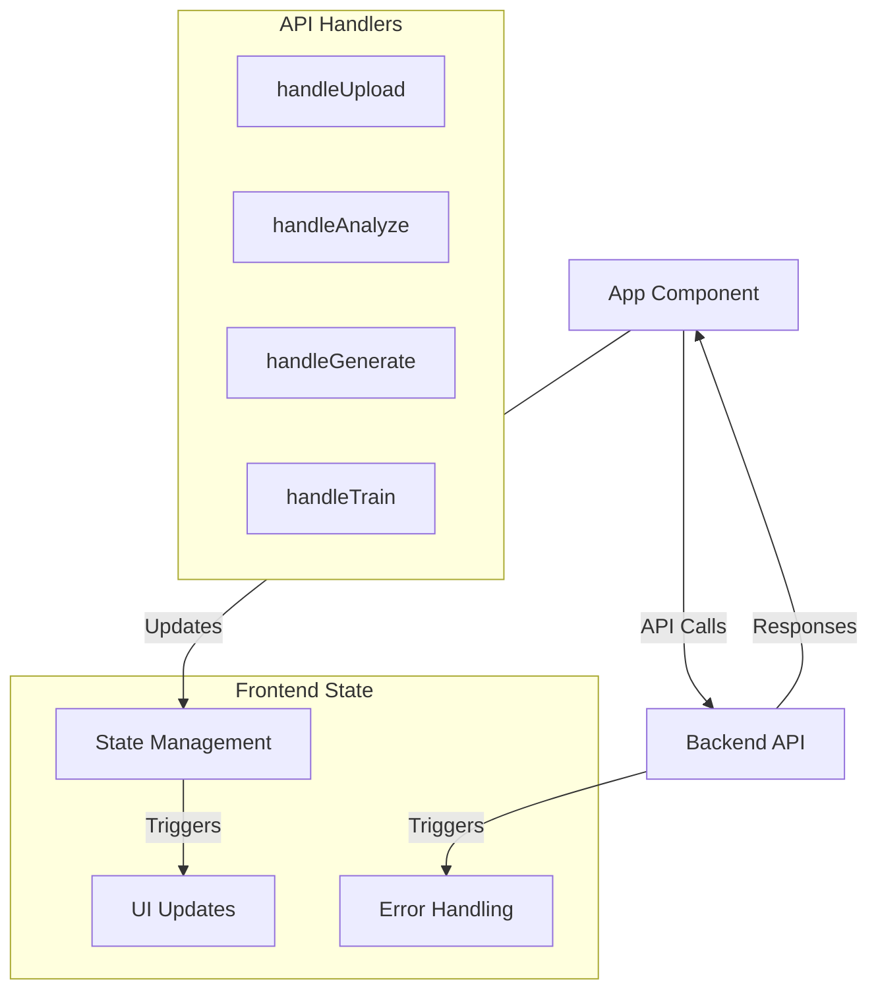
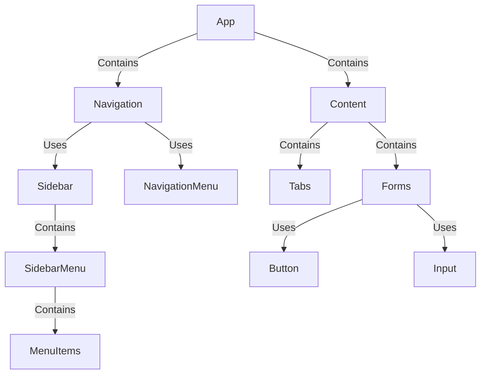
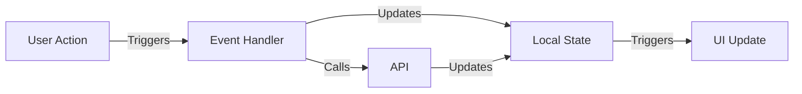

# Detailed Component Documentation

## Frontend Components

### 1. App Component
**File**: `/src/App.tsx`
**Purpose**: Main application container managing state and user interactions
**State Management**:
```typescript
const [file, setFile] = useState<File | null>(null);        // File upload state
const [code, setCode] = useState('');                       // Code analysis state
const [description, setDescription] = useState('');         // Code generation state
const [directory, setDirectory] = useState('');             // Training directory state
const [result, setResult] = useState<any>(null);           // API response state
const [error, setError] = useState<string | null>(null);    // Error handling state
```

**Functions**:
1. `handleUpload()`
   - Purpose: Process file uploads for code analysis
   - Interactions: 
     - Frontend validation
     - API endpoint: POST /api/documents
   - Flow:
     ```mermaid
     sequenceDiagram
         participant UI as User Interface
         participant Handler as handleUpload
         participant API as Backend API
         
         UI->>Handler: File Selected
         Handler->>Handler: Validate Size
         Handler->>Handler: Create FormData
         Handler->>API: POST Request
         API-->>Handler: Response/Error
         Handler-->>UI: Update State
     ```

2. `handleAnalyze()`
   - Purpose: Submit code for analysis
   - Interactions:
     - Frontend validation
     - API endpoint: POST /api/analyze
   - Flow:
     ```mermaid
     sequenceDiagram
         participant UI as User Interface
         participant Handler as handleAnalyze
         participant API as Backend API
         
         UI->>Handler: Code Input
         Handler->>Handler: Validate Input
         Handler->>API: POST Request
         API-->>Handler: Analysis Results
         Handler-->>UI: Update State
     ```

3. `handleGenerate()`
   - Purpose: Generate code from descriptions
   - Interactions:
     - Frontend validation
     - API endpoint: POST /api/generate
   - Flow:
     ```mermaid
     sequenceDiagram
         participant UI as User Interface
         participant Handler as handleGenerate
         participant API as Backend API
         
         UI->>Handler: Description Input
         Handler->>Handler: Validate Input
         Handler->>API: POST Request
         API-->>Handler: Generated Code
         Handler-->>UI: Update State
     ```

4. `handleTrain()`
   - Purpose: Train system with code examples
   - Interactions:
     - Frontend validation
     - API endpoint: POST /api/train
   - Flow:
     ```mermaid
     sequenceDiagram
         participant UI as User Interface
         participant Handler as handleTrain
         participant API as Backend API
         
         UI->>Handler: Directory Input
         Handler->>Handler: Validate Path
         Handler->>API: POST Request
         API-->>Handler: Training Status
         Handler-->>UI: Update State
     ```

### 2. Navigation Components

#### A. Sidebar Component
**File**: `/src/components/ui/sidebar.tsx`
**Purpose**: Provide collapsible navigation and thread management

**Key Components**:
1. `SidebarProvider`
   - Purpose: Manage sidebar state and context
   - State:
     ```typescript
     type SidebarContext = {
       state: "expanded" | "collapsed"
       open: boolean
       openMobile: boolean
       isMobile: boolean
     }
     ```

2. `SidebarContent`
   - Purpose: Content layout management
   - Interactions:
     - Parent: Sidebar
     - Children: SidebarMenu, SidebarGroup

3. `SidebarMenu`
   - Purpose: Navigation menu container
   - Interactions:
     - Parent: SidebarContent
     - Children: SidebarMenuItem

4. `SidebarMenuButton`
   - Purpose: Interactive menu items
   - Props:
     ```typescript
     interface Props {
       isActive?: boolean
       tooltip?: string
       variant?: "default" | "outline"
       size?: "default" | "sm" | "lg"
     }
     ```

#### B. Navigation Menu Component
**File**: `/src/components/ui/navigation-menu.tsx`
**Purpose**: Top-level navigation structure

**Components**:
1. `NavigationMenu`
   - Purpose: Root navigation container
   - Interactions:
     - Children: NavigationMenuList
     - Context: NavigationMenuContext

2. `NavigationMenuList`
   - Purpose: Menu items container
   - Interactions:
     - Parent: NavigationMenu
     - Children: NavigationMenuItem

3. `NavigationMenuTrigger`
   - Purpose: Interactive menu triggers
   - Features:
     - Hover states
     - Active states
     - Keyboard navigation

### 3. UI Components

#### A. Button Component
**File**: `/src/components/ui/button.tsx`
**Purpose**: Reusable button component

**Variants**:
```typescript
const buttonVariants = {
  default: "bg-zinc-900 text-zinc-50",
  destructive: "bg-red-500 text-zinc-50",
  outline: "border border-zinc-200",
  secondary: "bg-zinc-100 text-zinc-900",
  ghost: "hover:bg-zinc-100",
  link: "text-zinc-900 underline-offset-4"
}
```

**Sizes**:
```typescript
const buttonSizes = {
  default: "h-9 px-4 py-2",
  sm: "h-8 rounded-md px-3",
  lg: "h-10 rounded-md px-8",
  icon: "h-9 w-9"
}
```

#### B. Tabs Component
**File**: `/src/components/ui/tabs.tsx`
**Purpose**: Content organization and switching

**Components**:
1. `TabsList`
   - Purpose: Container for tab triggers
   - Styling: Flex container with rounded corners

2. `TabsTrigger`
   - Purpose: Interactive tab headers
   - States:
     - Active
     - Hover
     - Disabled

3. `TabsContent`
   - Purpose: Tab content container
   - Features:
     - Focus management
     - Accessibility attributes

## Function Interactions

### 1. Frontend-Backend Communication


### 2. Component Hierarchy


### 3. State Flow


## Error Handling

### 1. Frontend Validation
```typescript
// File size validation
if (file.size > MAX_FILE_SIZE) {
  setError('File too large (max: 1GB)');
  return;
}

// Input validation
if (!code) {
  setError('Please enter code to analyze');
  return;
}
```

### 2. API Error Handling
```typescript
try {
  const response = await fetch(endpoint);
  const data = await response.json();
  setResult(data);
  setError(null);
} catch (err) {
  setError('Error message');
  console.error(err);
}
```

## Configuration

### 1. API Configuration
```typescript
const API_URL = process.env.REACT_APP_API_URL || 'http://localhost:8000';
const API_KEY = process.env.REACT_APP_API_KEY;
const MAX_FILE_SIZE = 1024 * 1024 * 1024; // 1GB
```

### 2. UI Configuration
```typescript
const SIDEBAR_WIDTH = "16rem";
const SIDEBAR_WIDTH_MOBILE = "18rem";
const SIDEBAR_WIDTH_ICON = "3rem";
const MOBILE_BREAKPOINT = 768;
```
