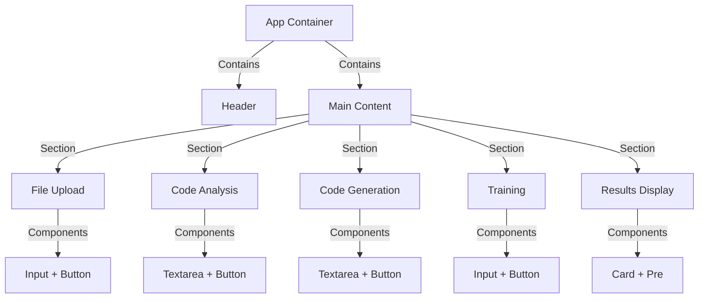

# Frontend Components Documentation

## Overview
The frontend of the Pronto 4GL Assistant provides a user-friendly interface for interacting with the code analysis and generation system. Built with React and TypeScript, it leverages modern UI components and practices.

## Key Components

### App Component
```typescript
// Main application component
function App() {
    // State Management
    const [file, setFile] = useState<File | null>(null);
    const [code, setCode] = useState('');
    const [description, setDescription] = useState('');
    const [directory, setDirectory] = useState('');
    const [result, setResult] = useState<any>(null);
    const [error, setError] = useState<string | null>(null);

    // API Integration Functions
    - handleUpload(): Process file uploads
    - handleAnalyze(): Submit code for analysis
    - handleGenerate(): Generate code from description
    - handleTrain(): Train system with code directory
}
```

### UI Components

1. **Button Component**
   - Purpose: Interactive button elements
   - Variants: default, destructive, outline, secondary, ghost, link
   - Sizes: default, sm, lg, icon
   - Usage: Form submissions, actions, navigation

2. **Input Component**
   - Purpose: Text input fields
   - Types: text, file, number
   - Features: Validation, error states, placeholder text
   - Usage: Form data entry, search, configuration

3. **Textarea Component**
   - Purpose: Multiline text input
   - Features: Auto-resize, validation
   - Usage: Code entry, descriptions, long-form text

4. **Card Component**
   - Purpose: Content containers
   - Features: Consistent styling, padding, borders
   - Usage: Group related content, form sections

5. **Alert Component**
   - Purpose: User notifications
   - Types: info, warning, error, success
   - Usage: Feedback, error messages, status updates

6. **Navigation Components**
   - Sidebar: Collapsible navigation panel
   - Tabs: Content organization
   - ScrollArea: Scrollable content regions

## State Management

### Local State
```typescript
// File Upload State
const [file, setFile] = useState<File | null>(null);

// Code Analysis State
const [code, setCode] = useState('');

// Code Generation State
const [description, setDescription] = useState('');

// Training State
const [directory, setDirectory] = useState('');

// Results and Error State
const [result, setResult] = useState<any>(null);
const [error, setError] = useState<string | null>(null);
```

### API Integration

1. **File Upload**
   ```typescript
   const handleUpload = async () => {
       // Validation
       // FormData preparation
       // API request
       // Response handling
   };
   ```

2. **Code Analysis**
   ```typescript
   const handleAnalyze = async () => {
       // Input validation
       // API request
       // Results processing
   };
   ```

3. **Code Generation**
   ```typescript
   const handleGenerate = async () => {
       // Description validation
       // API request
       // Code display
   };
   ```

4. **System Training**
   ```typescript
   const handleTrain = async () => {
       // Directory validation
       // Training request
       // Progress tracking
   };
   ```

## User Interface Layout



## Error Handling

1. **Input Validation**
   ```typescript
   // File size validation
   if (file.size > MAX_FILE_SIZE) {
       setError('File too large (max: 1GB)');
       return;
   }
   ```

2. **API Error Handling**
   ```typescript
   try {
       // API request
   } catch (err) {
       setError('Error message');
       console.error(err);
   }
   ```

3. **User Feedback**
   ```typescript
   // Success feedback
   setResult(data);
   setError(null);

   // Error feedback
   setError('Error message');
   ```

## Styling and Theming

1. **Base Styles**
   - Typography
   - Colors
   - Spacing
   - Borders

2. **Component Styles**
   - Consistent styling system
   - Dark/light mode support
   - Responsive design
   - Accessibility features

## Performance Considerations

1. **Optimizations**
   - Lazy loading
   - Debounced inputs
   - Memoized components
   - Efficient re-renders

2. **Best Practices**
   - TypeScript types
   - Error boundaries
   - Performance monitoring
   - Code splitting
