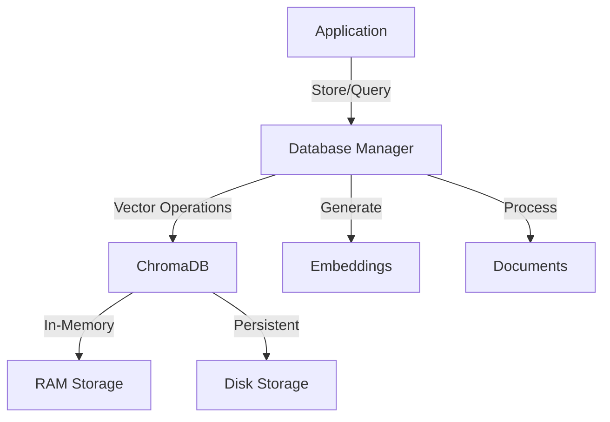
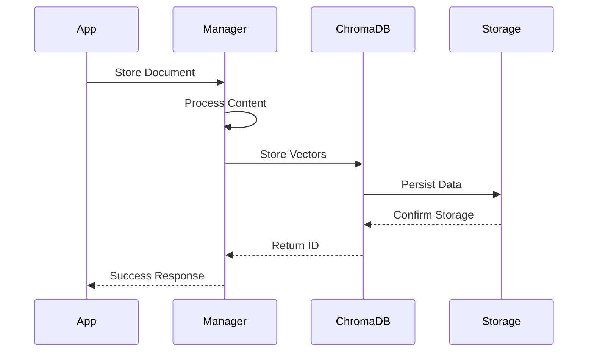
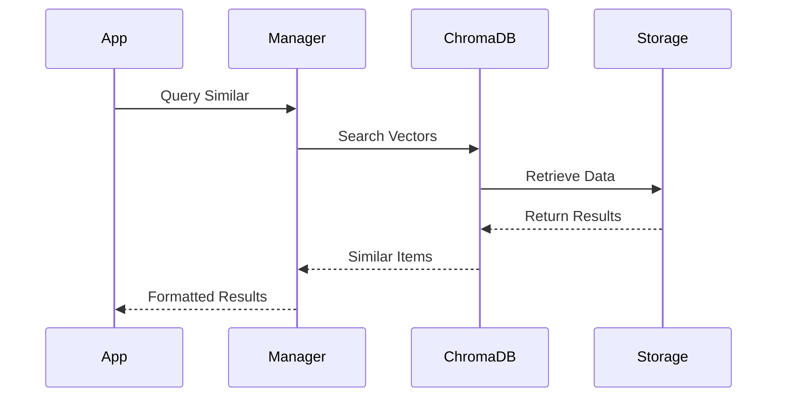
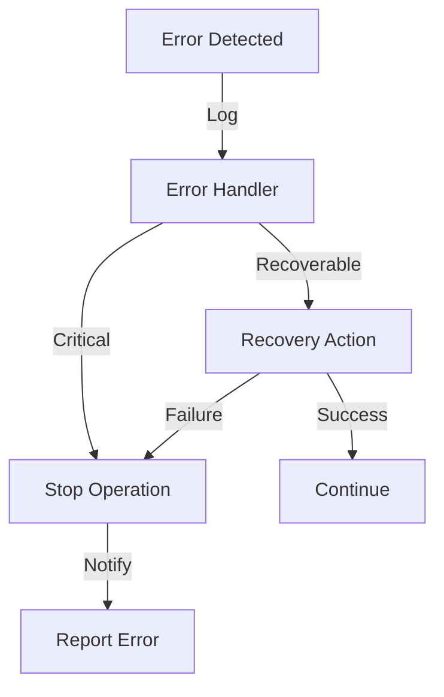
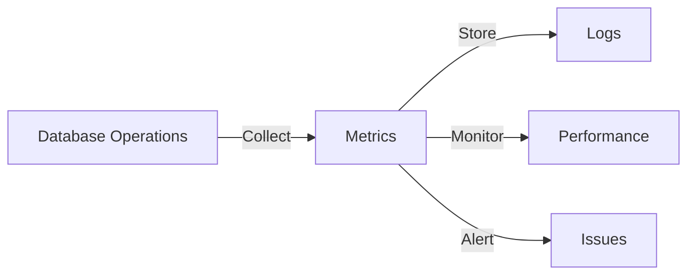
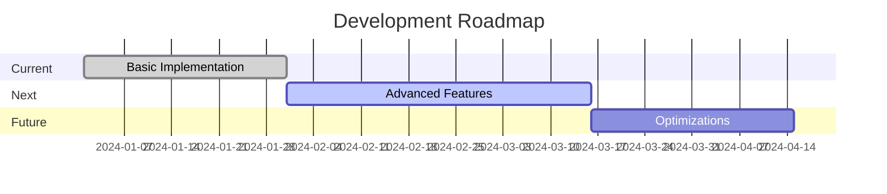

# In-Memory Database Architecture

## System Overview

The in-memory database system is built on ChromaDB and provides:
- Vector storage for code embeddings
- Similarity search capabilities
- Optional persistence
- Memory optimization



## Component Interactions

### Data Flow


### Query Flow


## Memory Management

### Storage Types
1. In-Memory
   - Fast access
   - Limited by RAM
   - Volatile storage

2. Persistent
   - Disk-based
   - Larger capacity
   - Durable storage

### Optimization Strategies
1. Chunking
   - Split large documents
   - Optimize chunk size
   - Maintain context

2. Indexing
   - Efficient retrieval
   - Automatic updates
   - Performance tuning

## Error Handling

### Recovery Process


## Security Model

### Access Control
1. Authentication
   - API keys
   - User roles
   - Access levels

2. Data Protection
   - Input validation
   - Output sanitization
   - Encryption options

## Performance Monitoring

### Metrics Collection


## Scaling Considerations

### Horizontal Scaling
1. Multiple instances
2. Load balancing
3. Data synchronization

### Vertical Scaling
1. Memory optimization
2. CPU utilization
3. Storage efficiency

## Implementation Details

### Core Classes
```python
class DatabaseManager:
    """
    Manages database operations and connections.
    
    Attributes:
        client: ChromaDB client
        code_collection: Collection for code
        documents_collection: Collection for docs
    """
    
class CodeEmbeddings:
    """
    Handles code vector embeddings.
    
    Methods:
        encode_code(): Generate embeddings
        encode_query(): Process search queries
    """
```

### Key Methods
```python
def add_code_snippet():
    """Store code with metadata and embedding."""
    
def query_similar_code():
    """Find similar code examples."""
    
def get_document_by_id():
    """Retrieve specific document."""
```

## Configuration Management

### Settings Structure
```python
CHROMA_CONFIG = {
    "persist_directory": "./data/chroma",
    "collection_name": "pronto_4gl",
    "embedding_dimension": 384
}

DB_CONFIG = {
    "allow_reset": True,
    "anonymized_telemetry": False
}
```

## Backup and Recovery

### Backup Process
1. Export collections
2. Save metadata
3. Store configurations
4. Version control

### Recovery Steps
1. Restore collections
2. Verify integrity
3. Rebuild indexes
4. Test functionality

## Future Enhancements

### Planned Features
1. Advanced caching
2. Better compression
3. Enhanced security
4. Performance optimizations

### Roadmap

