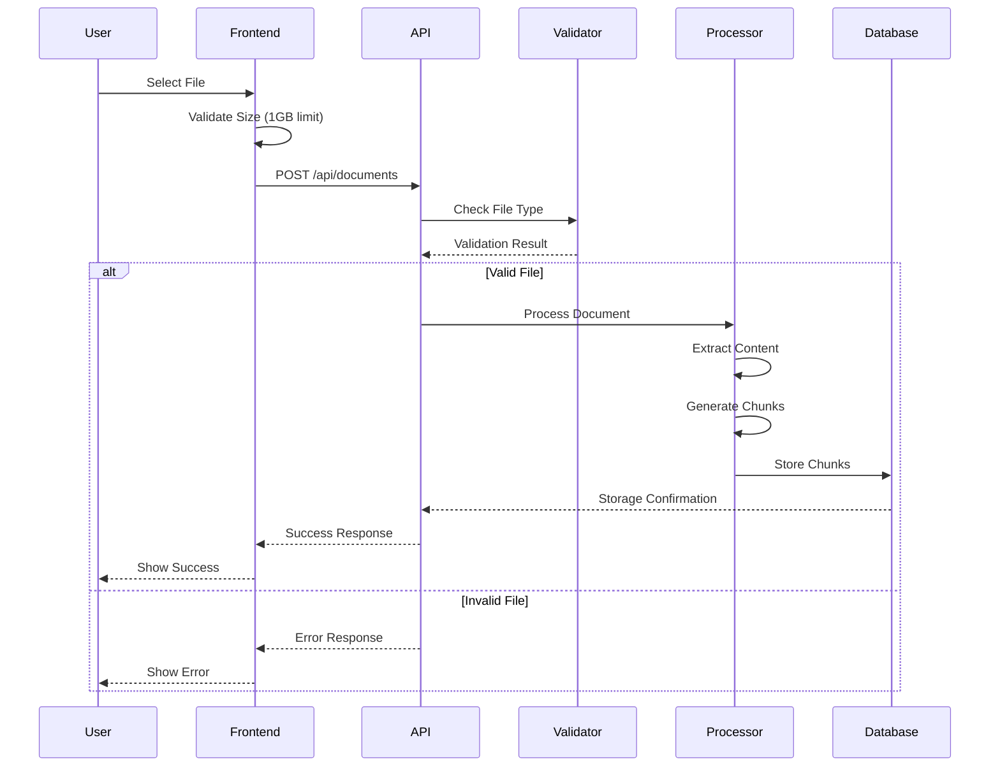
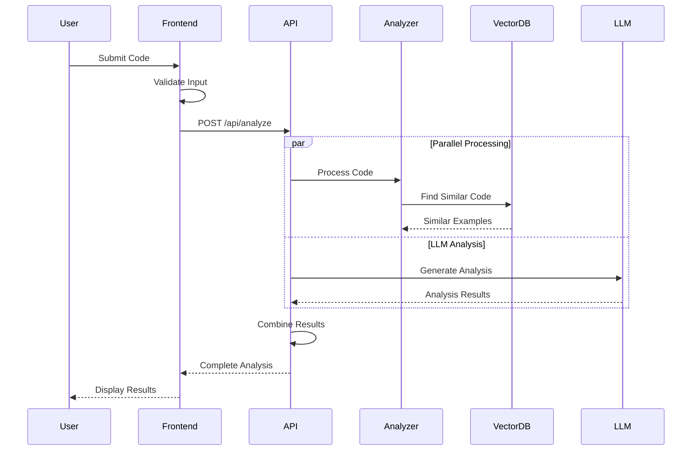
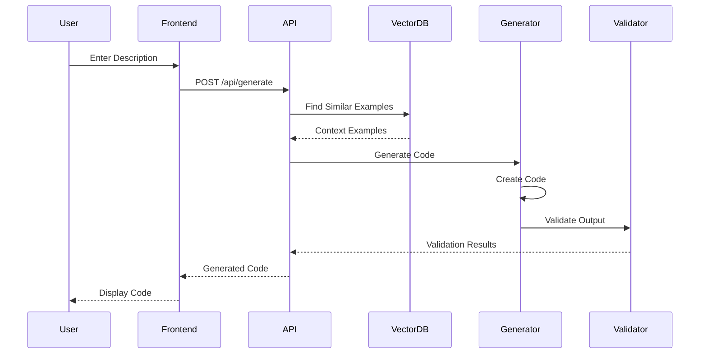
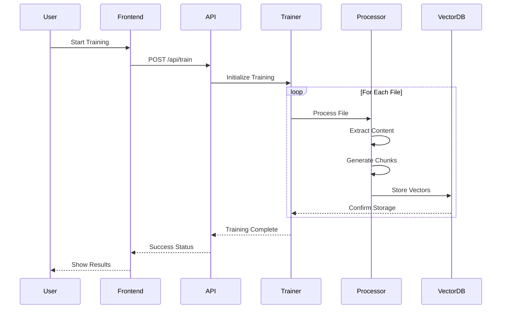
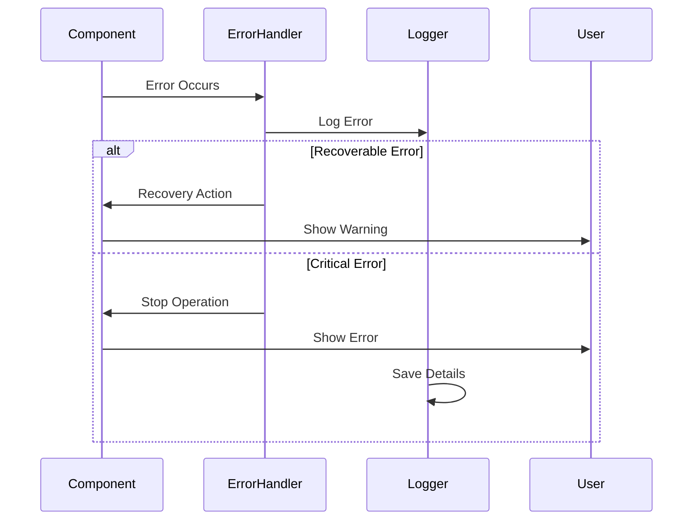

# Execution Flow Charts and Explanations

## 1. Document Upload Flow

### Document Upload Flow Explanation
1. **Initial Upload**
   - User selects a file through the frontend interface
   - Frontend validates file size (1GB limit)
   - File is sent to API endpoint

2. **Validation Phase**
   - API receives file and checks type
   - Validates file format and content
   - Returns early if validation fails

3. **Processing Phase**
   - Document content is extracted
   - Content is split into processable chunks
   - Metadata is extracted and preserved

4. **Storage Phase**
   - Processed chunks are stored in database
   - Metadata is associated with chunks
   - Storage confirmation is received

5. **Response Phase**
   - Success/error status returned to frontend
   - User receives visual feedback
   - Results displayed if successful

## 2. Code Analysis Flow

### Code Analysis Flow Explanation
1. **Input Phase**
   - User enters code in frontend
   - Frontend validates input format
   - Code sent to analysis endpoint

2. **Processing Phase**
   - Code is processed in parallel:
     * Vector similarity search
     * LLM-based analysis
   - Results are combined

3. **Analysis Phase**
   - Similar code examples identified
   - Code quality metrics generated
   - Suggestions formulated

4. **Response Phase**
   - Combined results sent to frontend
   - Results formatted for display
   - User sees analysis output

## 3. Code Generation Flow

### Code Generation Flow Explanation
1. **Input Phase**
   - User provides description
   - Description sent to API
   - Initial validation performed

2. **Context Gathering**
   - Similar code examples found
   - Context extracted
   - Examples prioritized

3. **Generation Phase**
   - Code generated using context
   - Output formatted
   - Syntax validated

4. **Delivery Phase**
   - Code sent to frontend
   - Syntax highlighting applied
   - User receives result

## 4. Training System Flow

### Training System Flow Explanation
1. **Initialization**
   - User initiates training
   - System prepares for processing
   - Resources allocated

2. **File Processing**
   - Each file processed individually
   - Content extracted and validated
   - Chunks generated for storage

3. **Vector Generation**
   - Code converted to vectors
   - Embeddings generated
   - Metadata preserved

4. **Storage Phase**
   - Vectors stored in database
   - Indexes updated
   - Storage verified

5. **Completion**
   - Training status updated
   - Statistics generated
   - Results displayed

## 5. Error Handling Flow

### Error Handling Flow Explanation
1. **Error Detection**
   - Component encounters error
   - Error details captured
   - Severity assessed

2. **Error Processing**
   - Error logged for tracking
   - Error type determined
   - Recovery options evaluated

3. **Recovery Attempt**
   - Recovery actions initiated
   - System state validated
   - Operation resumed if possible

4. **User Notification**
   - Appropriate message selected
   - User interface updated
   - Next steps indicated
