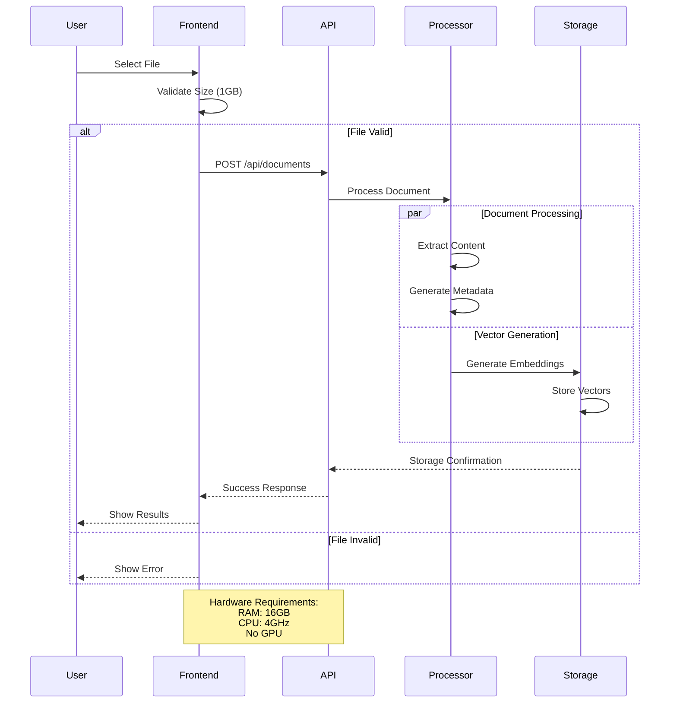
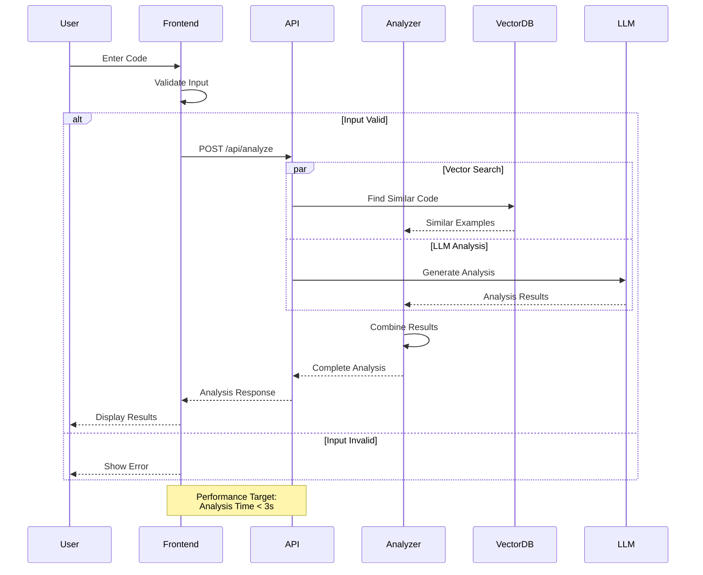
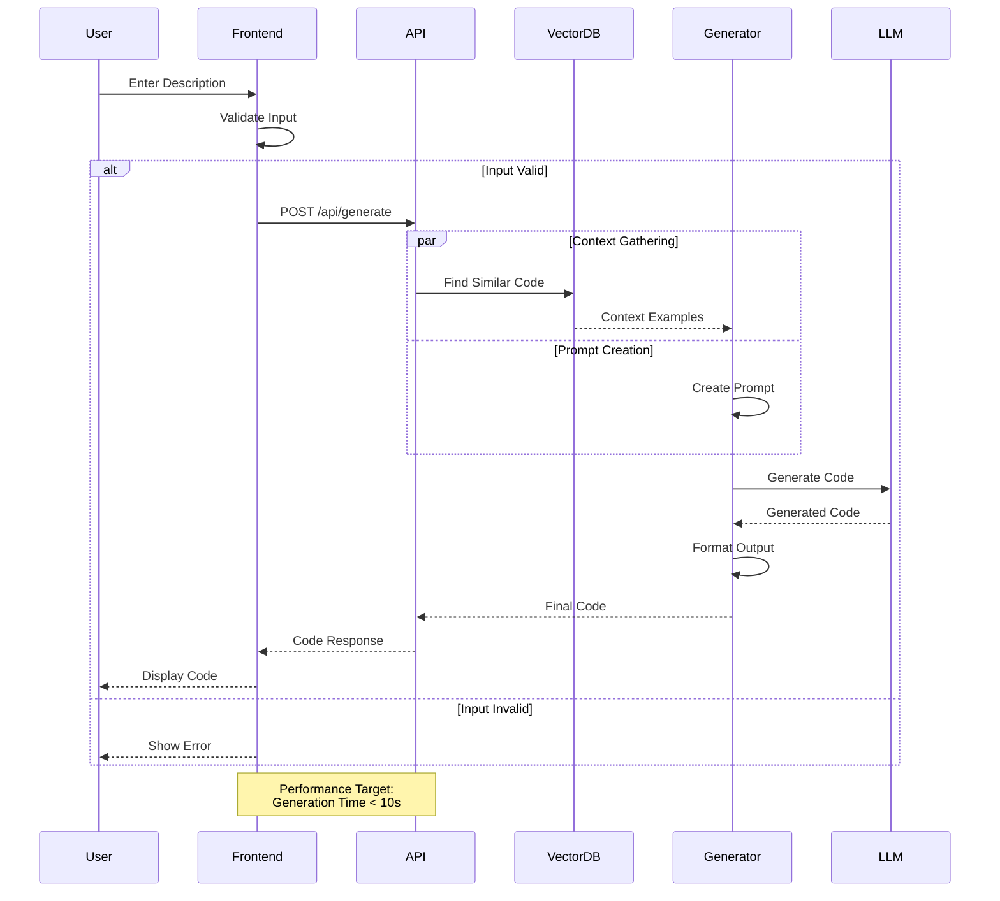
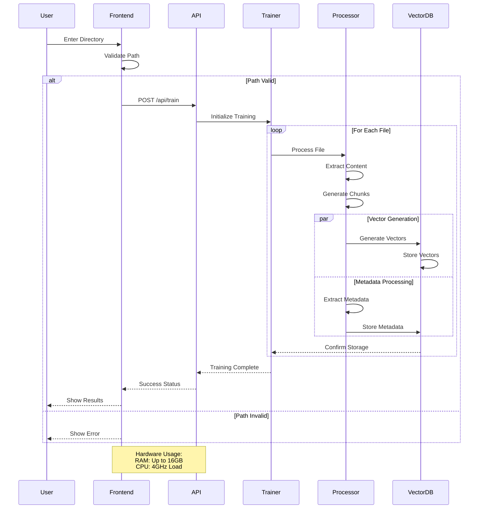
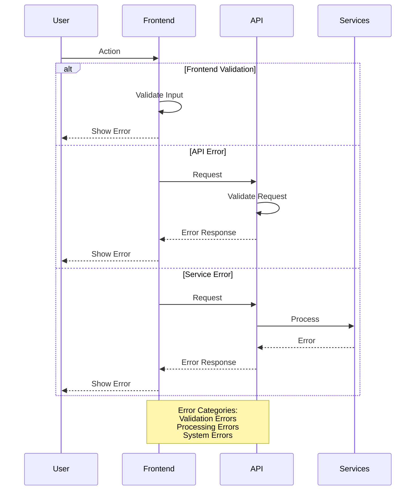

# Function Execution Flow Charts

## 1. Document Upload Flow


## 2. Code Analysis Flow


## 3. Code Generation Flow


## 4. Training System Flow


## 5. Component Interaction Flow
```mermaid
graph TD
    A[Frontend Components] -->|API Calls| B[Backend API]
    B -->|Responses| A
    
    subgraph "Frontend Layer"
        A -->|State Updates| C[React Components]
        C -->|User Input| D[Event Handlers]
        D -->|API Requests| A
    end
    
    subgraph "API Layer"
        B -->|Routes| E[API Controllers]
        E -->|Processing| F[Core Services]
    end
    
    subgraph "Processing Layer"
        F -->|Document Processing| G[Document Processor]
        F -->|Vector Operations| H[Vector Database]
        F -->|Code Generation| I[LLM Interface]
    end
    
    subgraph "Storage Layer"
        G -->|Store| J[File Storage]
        H -->|Index| K[Vector Storage]
        I -->|Cache| L[Response Cache]
    end
    
    note over "Frontend Layer","Storage Layer": System Requirements:<br/>RAM: 16GB<br/>CPU: 4GHz<br/>Storage: Based on usage
```

## 6. Error Handling Flow


## 7. State Management Flow
```mermaid
graph TD
    A[User Action] -->|Trigger| B[Event Handler]
    B -->|Update| C[Local State]
    B -->|API Call| D[Backend API]
    D -->|Response| C
    C -->|Render| E[UI Update]
    
    subgraph "State Types"
        F[File State]
        G[Code State]
        H[Result State]
        I[Error State]
    end
    
    C -->|Manages| F
    C -->|Manages| G
    C -->|Manages| H
    C -->|Manages| I
    
    note over "State Types": Memory Usage:<br/>Efficient state management<br/>within 16GB RAM limit
```

## 8. Performance Flow
```mermaid
graph LR
    A[Request] -->|Process| B[API Layer]
    B -->|Handle| C[Processing Layer]
    
    subgraph "Performance Targets"
        D[Upload: <5s]
        E[Analysis: <3s]
        F[Generation: <10s]
    end
    
    C -->|Meet| D
    C -->|Meet| E
    C -->|Meet| F
    
    note over "Performance Targets": Hardware Specs:<br/>4GHz CPU<br/>16GB RAM<br/>No GPU acceleration
```
