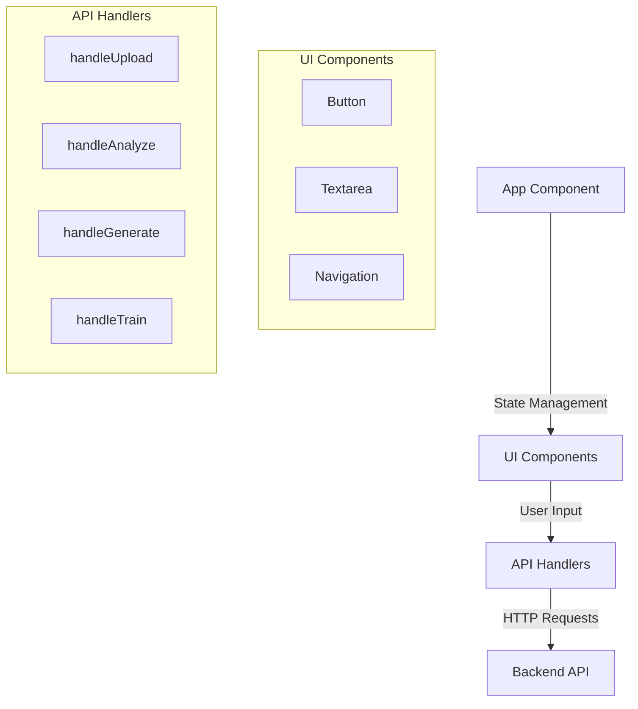
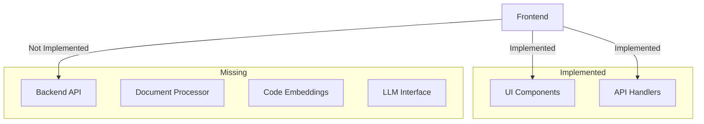

# Implementation Review

## 1. Existing Components

### Frontend Components

#### A. App Component (App.tsx)
- **Purpose**: Main application container managing state and API interactions
- **Key Functions**:
  - `handleUpload()`: Manages file upload with 1GB limit
  - `handleAnalyze()`: Handles code analysis requests
  - `handleGenerate()`: Manages code generation from descriptions
  - `handleTrain()`: Handles system training requests

#### B. Navigation Components
1. **Sidebar (sidebar.tsx)**
   - **Purpose**: Provides collapsible navigation panel
   - **Key Components**:
     - `SidebarProvider`: Manages sidebar state and context
     - `SidebarContent`: Handles content layout
     - `SidebarMenu`: Navigation menu container
     - `SidebarMenuButton`: Interactive menu items

2. **Navigation Menu (navigation-menu.tsx)**
   - **Purpose**: Top-level navigation structure
   - **Components**:
     - `NavigationMenu`: Root navigation container
     - `NavigationMenuList`: Menu items container
     - `NavigationMenuTrigger`: Interactive menu triggers

#### C. UI Components
1. **Button (button.tsx)**
   - **Purpose**: Reusable button component
   - **Variants**: default, destructive, outline, secondary, ghost, link
   - **Sizes**: default, sm, lg, icon

2. **Tabs (tabs.tsx)**
   - **Purpose**: Content organization
   - **Components**:
     - `TabsList`: Container for tab triggers
     - `TabsTrigger`: Interactive tab headers
     - `TabsContent`: Tab content container

### Missing Backend Components
The following components are documented but not implemented:

1. **Document Processor**
   - Status: Not implemented
   - Expected Location: src/core/document_processor.py
   - Purpose: Process and validate Pronto 4GL documents

2. **Code Embeddings**
   - Status: Not implemented
   - Expected Location: src/core/embeddings.py
   - Purpose: Generate and manage code vector embeddings

3. **LLM Interface**
   - Status: Not implemented
   - Expected Location: src/core/llm.py
   - Purpose: Interface with language model for code generation

4. **API Routes**
   - Status: Not implemented
   - Expected Location: src/api/routes.py
   - Purpose: Handle HTTP endpoints for frontend interaction

## 2. Component Interactions

### Frontend Flow

### Current Implementation State

## 3. Function Execution Flow

### A. Document Upload Flow
1. User selects file through UI
2. Frontend validates file size (1GB limit)
3. `handleUpload()` prepares FormData
4. API request attempted (fails - no backend)

### B. Code Analysis Flow
1. User enters code in textarea
2. Frontend validates input
3. `handleAnalyze()` prepares request
4. API request attempted (fails - no backend)

### C. Code Generation Flow
1. User enters description
2. Frontend validates input
3. `handleGenerate()` prepares request
4. API request attempted (fails - no backend)

### D. Training Flow
1. User enters directory path
2. Frontend validates input
3. `handleTrain()` prepares request
4. API request attempted (fails - no backend)

## 4. Implementation Gaps

1. **Backend Services**
   - All backend components need implementation
   - API endpoints need to be created
   - Data processing pipeline missing

2. **Data Storage**
   - Vector database not implemented
   - Document storage not configured
   - Training data persistence missing

3. **Integration Points**
   - Frontend expects API endpoints that don't exist
   - Error handling needs backend-specific cases
   - API response handling needs implementation

## 5. Next Steps

1. **Critical Components**
   - Implement core backend services
   - Create API endpoints
   - Set up document processing

2. **Integration**
   - Connect frontend to backend
   - Implement proper error handling
   - Add response processing

3. **Testing**
   - Add backend unit tests
   - Implement integration tests
   - Verify frontend-backend communication
